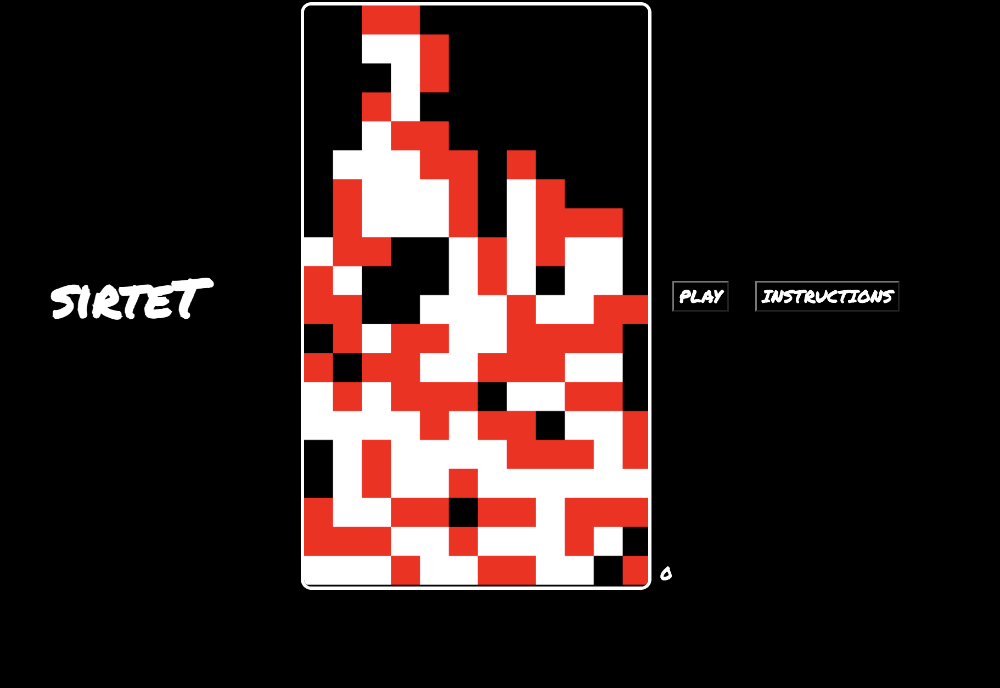
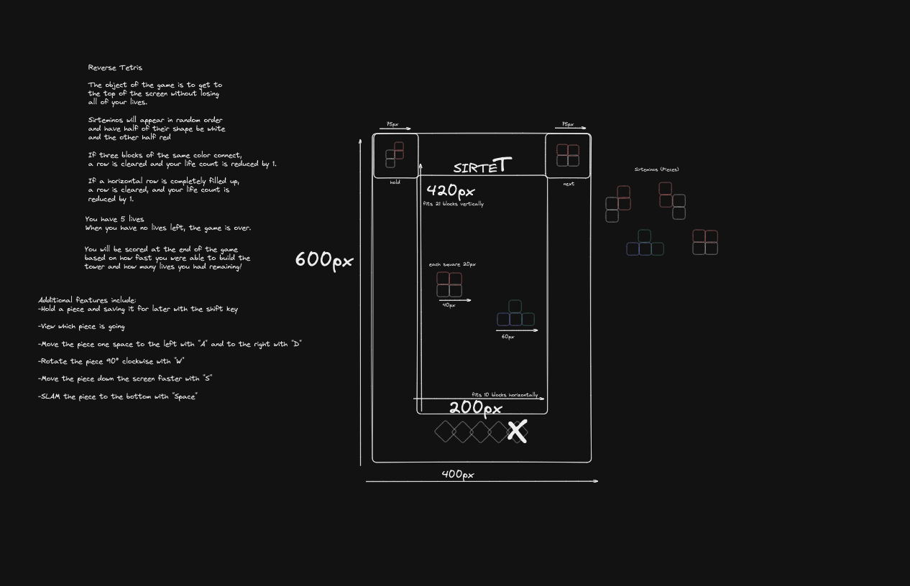

# sirteT
GA Project 1 

Welcome to the first stages of sirteT! The reverse Tetris puzzle game. 
The project is still a work in progress. To play the current version, vist: https://sirtet-game.netlify.app/

# How To Play: 
 A = Moves the piece one column to the left

 D = Moves the piece one column to the right 

 S = Speeds up the piece's descent

 W = Rotates the piece 90 degrees 

# Objectives:
 Fill the rows with blocks in order to score points. Each row cleared will net you 100 points. The game ends when the game board is filled up and reaches the top of the screen. 


Fail State 



# Design

sirteT only uses 5 different pieces, and has intentionally removed certain pieces classic to Tetris. At the end of the project, the goal will be to fill the board with as many pieces as possible without clearing rows or matching three adjacent colors vertically or horizontally 



# How it works

sirteT spawns random pieces by pulling data from a 2D array. For example, the "T Piece" is initally declared with an array that looks something like this 

```
const tPiece = [
    [1, 2, 2], 
    [0, 1, 0],
    [0, 0, 0]
]

(NOTE: The extra rows of zeroes is necessary for piece rotation!);
```

 Then, a seperate drawMatrix function loops through both of the arrays with a for each loop, then using a 2D canvas, draws images based off of inputs. 

In order to have logic that knows when a piece has landed at the bottom of the array or has collided with another piece, we have the detect position function. 

```
function recordPosition(board, player) {
    player.matrix.forEach((row, y) => {
        row.forEach((value, x) => {
            if (value !== 0) {
                board[y + player.pos.y][x + player.pos.x] = value;
            }
        });
    });
    console.log('record position'); 
}
```
This function records the values on the player.matrix, which is represented by the piece, and records that information on board array. 

Then, we redraw the piece on the array so that we can determine it's more permanenet "settled" state. 
```
function drawMatrix(matrix, offset) {
    matrix.forEach((row, y) => {
        row.forEach((value, x) => {
            if (value !== 0 && value !== 1) {
                context.fillStyle = 'white';
                context.fillRect(x + offset.x, y + offset.y, 1, 1);
            } else if (value !== 0 && value !== 2) {
                context.fillStyle = 'red';
                context.fillRect(x + offset.x, y + offset.y, 1, 1);
            }
        });
    });
}

function draw() {
    context.fillStyle = '#000';
    context.fillRect(0, 0, canvas.width, canvas.height);

    drawMatrix(board, {x: 0, y: 0});
    drawMatrix(player.matrix, player.pos);
}

//this draw() function also clears the board so that we aren't getting duplicated pieces and draws the pieces that have been recorded on the board!
```
Then, we have the collisionDetection function, which will detect whether or not the piece has exceeded the board's boundaries

```
function collisionDetection(board, player) {
    const m = player.matrix;
    const o = player.pos;
    for (let y = 0; y < m.length; ++y) {
        for (let x = 0; x < m[y].length; ++x) {
            if (m[y][x] !== 0 &&
               (board[y + o.y] &&
                board[y + o.y][x + o.x]) !== 0) {
                return true;
            }
        }
    }
    return false;
}
```

Next in use is the clearRow function, which checks whether or not a row on the board is filled with values. If so, it removes the row and adds a new one to the top of the array, simulating the effect of pieces moving down the board! 

```
function clearRow() {
    let rowCount = 1;
    outer: for (let y = board.length -1; y > 0; --y) {
        for (let x = 0; x < board[y].length; ++x) {
            if (board[y][x] === 0) {
                continue outer;
            }
        }

        const row = board.splice(y, 1)[0].fill(0);
        board.unshift(row);
        ++y;

        player.score += rowCount * 100;
        rowCount *= 2;
    }

    
}
//The function also adds 100 points to the player's score per row they clear!
```

We also have the reset() function, which is called upon when a piece is landed, its position recorded, and it has been combined with the board (and thus, redrawn); 

```
function pieceReset() {
    player.matrix = piecesArray[Math.floor(Math.random() * (piecesArray.length))];
    player.pos.y = 0;
    player.pos.x = 2;
    if (collisionDetection(board, player)) {
        resetBoard(); 
        pauseGame(); 
    }
     
}
//This is also the function that resets the board if the pieces reach the top
```
Finally, all of this is wrapped up nicely in the gameLoop function that it is executed in itself with requestAnimationFrame method 
NOTE: While the game was intially created with setInterval in mind, that added some interesting effects to the pieces scrolling. So, it's easier to just repaiint the screen with requestAnimationFrame, and then pass in gameLoop within itself. 

```
function gameLoop(time = 0) {
    const deltaTime = time - lastTime;

    dropCounter += deltaTime;
    if (dropCounter > dropInterval) {
        playerDrop();
    }
     

    lastTime = time;

    draw();
    requestAnimationFrame(gameLoop);
}
```

Beyond that, there is some basic movement functionality with the player move and player rotate functions 
```
function playerMove(direction) {
    player.pos.x += direction;
    if (collide(board, player)) {
        player.pos.x -= direction;
    }
}

//function that reverses the matrix and rotates 90 degrees 
function rotate(matrix) {
    for (let y = 0; y < matrix.length; ++y) {
        for (let x = 0; x < y; ++x) {
            [
                matrix[x][y],
                matrix[y][x],
            ] = [
                matrix[y][x],
                matrix[x][y],
            ];
        }
    }

    
        matrix.reverse();
    
}

//rotating the player and checking to see if rotating will move it out of the board
function playerRotate(direction) {
    const pos = player.pos.x;
    let offset = 1;
    rotate(player.matrix, direction);
    while (collide(board, player)) {
        player.pos.x += offset;
        offset = -(offset + (offset > 0 ? 1 : -1));
        if (offset > player.matrix[0].length) {
            rotate(player.matrix, -direction);
            player.pos.x = pos;
            return;
        }
    }
}

//movement control based on key press. passes through a direction
document.addEventListener('keydown', e => {
    if (e.key === 'a') {
        playerMove(-1);
    } else if (e.key === 'd') {
        playerMove(1);
    } else if (e.key === 's') {
        playerDrop();
    } else if (e.key === 'w') {
        playerRotate(-1);
    } 
});
//uses the event listener "keydown" to check for keys pressed and then transforms the piece accordingly
```

# UI

Play Button 

The gameLoop function exists under a conditional that will not run unless the gameState variable equals to "playing" 
By default, the variable is set to "Paused" and only switches when the play button is clicked. 


Instructions Button 

The Instructions button opens up a hidden DIV with a relative position so that it can sit over the game board. There is another close button that when clicked, will remove the div by setting its display to "none". 


# Stretch Goals 

Currently, sirteT is only in the early stages of the project. In order to build reverse-Tetris, you have to build Tetris first! So, that's more-or-less the state of the project as of right now. Tetris with fewer pieces. Here is a list of features I am going to implement. 

    - Add a "GAME OVER" screen that tallies total points generated through the game 
    - Add functionality to "hold" the current piece and save it for later use 
    - Add functionality to detect whether or not three pieces of the same color are adjacent, therefore clearing the row 
    - Add a "lives" mechanic that tallies down each time a row is cleared or three colors have been matched together 
    - Add logic to loop the board array and tally points based on whether how many points in the array are not 0
    - Add music to the game once it is playing
    - Add a functional pause button 
    - Add functionality that shows the next piece that's going to be played with 
    - Add difficulty levels 


